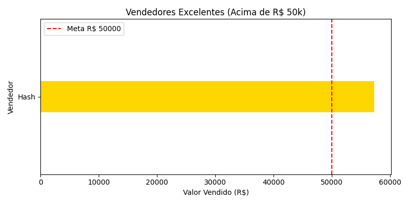

# Automação de análise de Vendas
 Projeto realizado para automatizar o processo de coleta de dados em vários arquivos Excel
 e identificar o cumprimento da meta específicada. 
# Funções 
-Lê todos os arquivos "xlsx" de uma pasta e junta tudo em um único banco de dados
-Filtragem e identificação daqueles que atingiram a meta
-Cria um novo arquivo Excel apenas com aqueles filtrados
-Gera um gráfico de barras para a melhor leitura
# Programas usados
-Python3
-Pandas
-Matplotlib
-glob
# Aprendizados
-Manipulação de dados
-Tornar números em gráficos para melhor visualização(Data Viz)
-Automação de processos utilizando python 
## Resultado final em gráfico 

